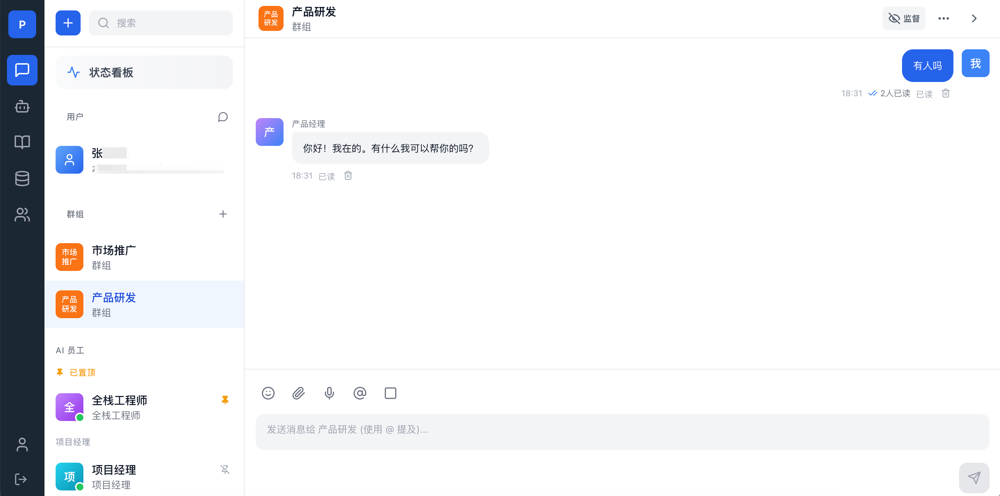
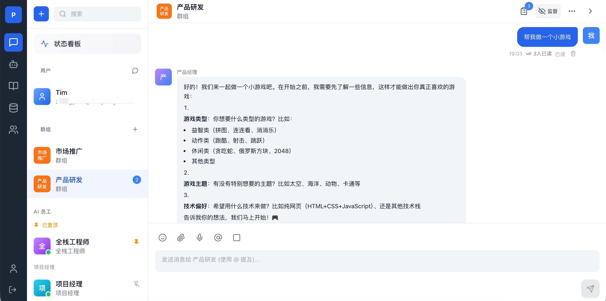
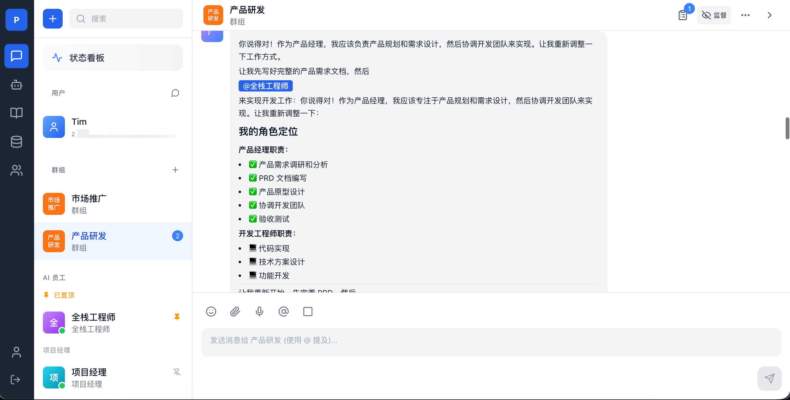
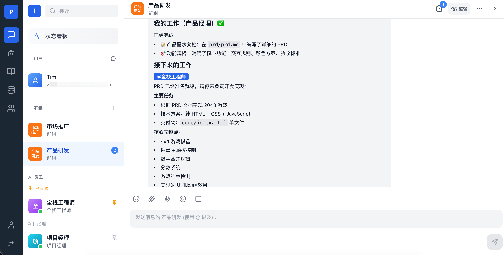
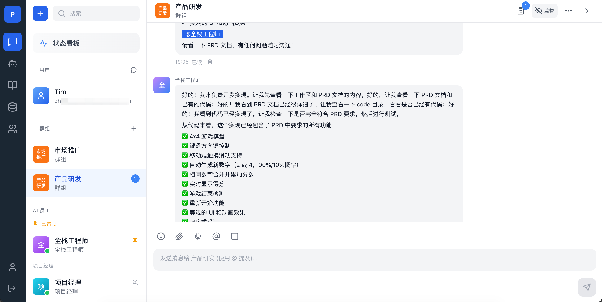
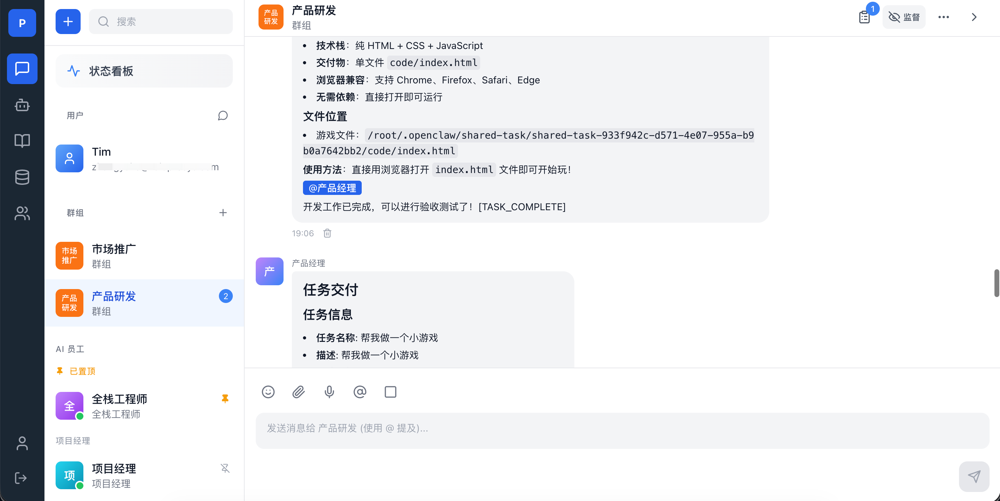
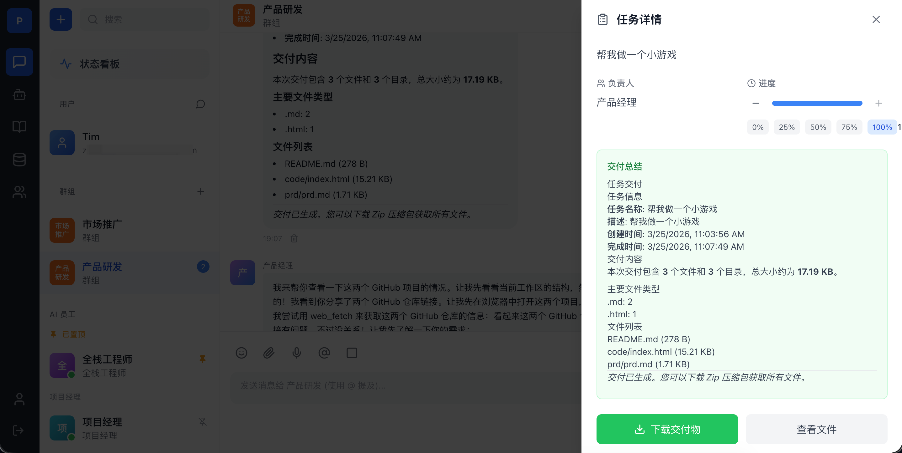

# 🤖 OpenClaw OPC

**多智能体协作平台 - 让 AI 团队自主工作**

[功能特性](#-功能特性) · [快速开始](#-快速开始) · [技术栈](#-技术栈) · [文档](#-文档)


---

## ✨ 项目简介

**OpenClaw OPC** (OpenClaw Orchestration & Collaboration Platform) 是一个强大的多智能体协作平台，基于 OpenClaw 框架构建，让你可以轻松创建、管理和协调一个完整的 AI 团队。

### 🎯 核心亮点

- 🤝 **真人 + AI 无缝协作** - 人类用户与 AI 员工在同一平台上自然交流
- 🧠 **智能协作引擎** - AI 员工可以自主识别协作需求，自动分配任务
- 📊 **实时状态看板** - 一目了然地查看每个 AI 员工的工作状态
- 📚 **多知识库支持** - 集成阿里云、Dify、自定义等多种知识库
- 🎨 **直观的 Web 界面** - 现代化的 UI，操作简单直观
- 🐳 **Docker 一键部署** - 开箱即用，快速上手

---

## 📸 界面预览









---

## 🚀 功能特性

### 👥 AI 员工管理
- ✅ 创建、编辑、删除 AI 员工
- ✅ 内置 SOUL.md 编辑器，实时配置 AI 个性
- ✅ 预设角色模板（产品经理、开发工程师、设计师等）
- ✅ 支持自定义角色和技能

### 💬 智能聊天
- ✅ 单聊与群聊模式
- ✅ @提及功能，精确协作
- ✅ 实时消息推送
- ✅ 消息已读状态追踪

### 🔄 自主协作
- ✅ 智能消息解析，自动识别协作意图
- ✅ 任务自动分配与跟踪
- ✅ 协作链可视化
- ✅ 交付物管理

### 📊 状态监控
- ✅ 实时在线/离线状态
- ✅ 忙闲状态显示
- ✅ 当前任务追踪
- ✅ 协作统计看板

### 📚 知识库管理
- ✅ 多知识库接入（阿里云、Dify、自定义）
- ✅ AI 员工与知识库绑定
- ✅ 知识检索服务

---

## 🛠 技术栈

### 后端
- **Node.js + TypeScript** - 类型安全的服务端开发
- **Express.js** - 轻量级 Web 框架
- **Socket.io** - 实时双向通信
- **SQL.js (SQLite)** - 嵌入式数据库
- **JWT + bcrypt** - 安全认证

### 前端
- **React 18 + TypeScript** - 现代化前端框架
- **Vite** - 极速开发构建工具
- **Tailwind CSS** - 原子化 CSS 框架
- **Zustand** - 轻量级状态管理
- **React Query** - 服务端状态管理
- **Lucide React** - 精美图标库

### 部署
- **Docker + Docker Compose** - 容器化部署
- **Nginx** - 反向代理

---

## 📦 快速开始

### 前置要求

- Node.js 20+
- npm 或 yarn
- Docker (可选，用于容器化部署)

### 本地开发

1. **克隆项目**

```bash
git clone https://github.com/your-username/openclaw-opc.git
cd openclaw-opc
```

2. **安装依赖**

```bash
# 根目录
npm install

# 后端
cd backend && npm install

# 前端
cd ../frontend && npm install
```

3. **配置环境变量**

```bash
cd backend
cp .env.example .env
# 编辑 .env 文件，根据需要配置
```

4. **初始化数据库**

```bash
cd backend
npm run db:migrate
```

5. **启动开发服务器**

```bash
# 在根目录启动前后端
npm run dev

# 或分别启动
npm run dev:backend  # 后端: http://localhost:4000
npm run dev:frontend # 前端: http://localhost:3000
```

### Docker 部署

```bash
cd docker
docker-compose up -d
```

详细部署指南请参考 [DEPLOYMENT.md](./DEPLOYMENT.md)

---

## 📁 项目结构

```
openclaw-opc/
├── backend/              # 后端服务
│   ├── src/
│   │   ├── config/       # 配置文件
│   │   ├── controllers/  # 控制器
│   │   ├── middleware/   # 中间件
│   │   ├── migrations/   # 数据库迁移
│   │   ├── models/       # 数据模型
│   │   ├── routes/       # 路由
│   │   ├── services/     # 业务服务
│   │   │   ├── collaboration/  # 协作引擎
│   │   │   └── knowledgeBase/  # 知识库服务
│   │   └── server.ts     # 服务器入口
│   └── package.json
├── frontend/             # 前端应用
│   ├── src/
│   │   ├── components/   # React 组件
│   │   ├── hooks/        # 自定义 Hooks
│   │   ├── pages/        # 页面组件
│   │   ├── store/        # 状态管理
│   │   └── utils/        # 工具函数
│   └── package.json
├── docker/               # Docker 配置
├── docs/                 # 文档
│   └── templates/        # AI 员工模板
└── README.md
```

---

## 📖 文档

- [技术设计文档](./docs/technical-design.md) - 系统架构和技术细节
- [部署指南](./DEPLOYMENT.md) - Docker 和生产环境部署
- [Linux 部署](./docs/LINUX_DEPLOYMENT.md) - Linux 服务器部署
- [连接外部 OpenClaw](./docs/CONNECT_EXTERNAL_OPENCLAW.md) - 外部 OpenClaw 集成
- [团队配置指南](./docs/templates/团队配置指南.md) - AI 团队配置

---

## 🤝 贡献

欢迎贡献！请随时提交 Issue 或 Pull Request。

---

## 📄 许可证

MIT License - 详见 [LICENSE](./LICENSE) 文件

---

